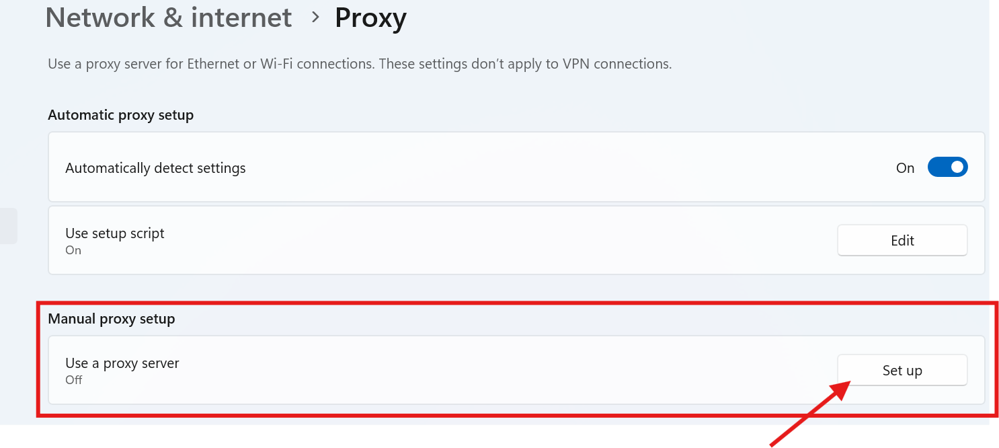
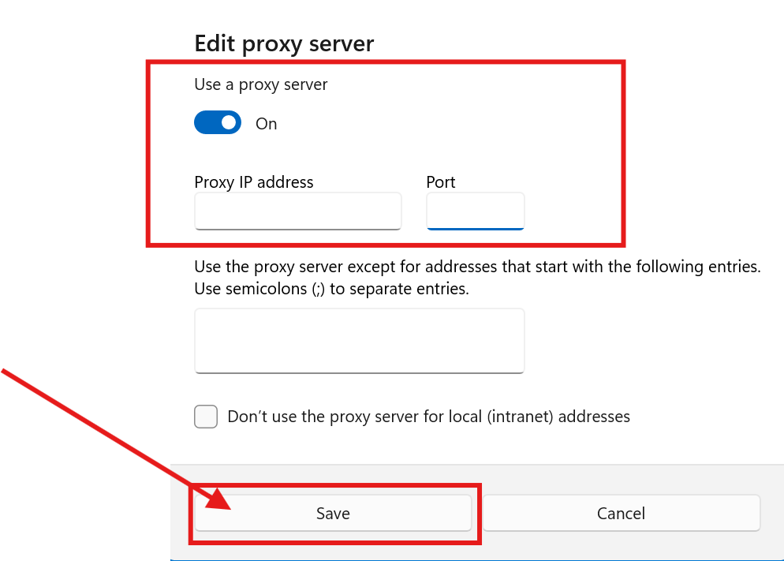

# Selenium Scrapper Automation

A Python-based automation tool using Selenium to scrape data from websites efficiently.


## Table of Contents

- [Installation](#installation)
- [ProxySetup](#proxy-server-setup)
- [Usage](#usage)
- [Features](#features)
- [Contributing](#contributing)
- [License](#license)

## Installation

1. **Clone the repository:**

   ```bash
   git clone https://github.com/MohmmedFurqaan/selenium-scrapper-automation.git
   ```

   **Go to the project**

   ```bash
   cd selenium-scrapper-automation
   ```

2. **(Recommended) Install [uv](https://docs.astral.sh/uv/getting-started/installation/#installation-methods):**

   ```bash
   pip install uv
   ```

3. **Install dependencies:**
   1. By UV (Recommended)

   ```bash
   uv sync
   ```

   2. **By pip**
   ```bash
   pip install .
   ```

## Proxy server setup 

**Why use a proxy?**  
Websites like Amazon may block your IP after repeated requests. Using proxies helps avoid this.

### 1. Sign Up & Get Proxies from Webshare.io

1. Go to [webshare.io](https://www.webshare.io/) and create a free account.
2. After login, go to the **Dashboard** → **Proxies**.
3. Click **Download Proxies** and choose the format (IP:PORT).
4. Save the list as `proxy.txt` in your project root (**Recomended**).

### 2. (Optional) Whitelist Your Own IP

- In Webshare dashboard, go to **Proxy Access** → **Whitelist IPs**.
- Add your current IP address to allow access to the proxies.

### 3. Configure Selenium to Use a Proxy

- go to your **settings**

- search for the **proxy setting** > then click on the edit setup from the **Manual Proxy Setup** as shown below:




- After clicking, you will see the dialoge box to setup your proxy from the Dowloaded proxy list **proxy.txt** 



**Note:**

- Rotate proxies for each request for better anonymity.
- Make sure your IP is whitelisted on Webshare.io if required.


### 4. Run the Scraper tool

```bash
cd src
```

```bash
uv run main.py
```


## Usage

- Run the script to scrape data from a website.
- Configure the settings in `config.py`.

## Features

- Efficient data scraping using Selenium.
- Configurable settings for different websites.
- Easy to extend and modify.